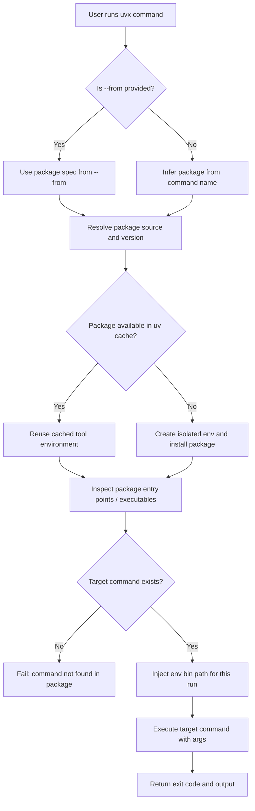

## Overview
`uvx` is the tool-first entrypoint in the `uv` ecosystem.
Its default behavior is to run a CLI tool in an isolated, temporary environment without globally installing the package.

`uvx` is an alias of `uv tool run`, so these two are equivalent:

```bash
uvx ruff
uv tool run ruff
```

This gives Python developers a practical "install-nothing, run-now" experience similar to `npx`.

## Why it matters

- **Zero global pollution:** one-off tools do not leak into system Python.
- **Fast trial loop:** test a tool or version immediately.
- **Safe isolation:** tool dependencies stay separate from project dependencies.
- **Clear lifecycle:** ephemeral execution (`uvx`) vs persistent installation (`uv tool install`).

## Execution Decision Model
Use this quick model to choose the right command:
1. **Temporary tool execution:** `uvx <tool>` for ad-hoc usage.
2. **Project-coupled execution:** `uv run <tool>` when the tool should run with project context.
3. **Persistent daily tools:** `uv tool install <pkg>` for frequently used CLIs.

The key is choosing the right execution boundary, not forcing one command for all scenarios.

Important boundary: `uv tool install` exposes executables on `PATH`, but it does not make tool modules importable in your current Python interpreter. Tool environments remain isolated by design.

Example persistent install:

```bash
uv tool install ruff
ruff --version
```

## uvx Executable Resolution Flow

The following flow focuses on how `uvx` locates the executable and runs it.



- `uvx <cmd>` is equivalent to `uv tool run <cmd>`.
- Use `--from` when package name and command name differ.
- The runtime stays isolated; no global installation is required for execution.

### What "Inspect package entry points / executables" means

At this stage, `uvx` checks the installed package metadata to determine which command can be launched.

1. Read the package's declared console entry points (typically from `[project.scripts]` in `pyproject.toml`).
2. Build executable wrappers in the tool environment's `bin` directory.
3. Match the requested command name against available executable names.
4. If no command matches, fail with a "command not found in package" style error.
5. If exactly one command matches, execute it with the provided arguments.

Example package metadata:

```toml
[project.scripts]
hello-uvx = "hello_uvx.cli:main"
```

In this example, `uvx` can execute `hello-uvx` after resolving/installing the package source.

### What "Inject env bin path for this run" means

This step means `uvx` temporarily prepends the selected tool environment `bin` directory to `PATH` for the current process only.

- `uvx` does not directly run `python cli.py`.
- It runs the generated executable entry point (for example, `hello-uvx`) from the isolated tool environment.
- The `PATH` change is temporary and does not persist after command exit.

Conceptually:

```text
Before run: PATH=/usr/local/bin:...
During run: PATH=<uv-tool-env>/bin:/usr/local/bin:...
After run:  PATH=/usr/local/bin:...
```

In local-source usage like `uvx --from . hello-uvx`, the executable usually lives under uv cache-managed directories, e.g.:

```text
/Users/<you>/.cache/uv/archive-v0/<hash>/bin/hello-uvx
```

The `<hash>` is an environment fingerprint, not a run counter:

- Same resolved environment inputs usually reuse the same hash directory.
- Different inputs (source/version/dependencies/Python context) may produce a different hash directory.

## Core uvx Workflows

### 1. Run a tool without installation

```bash
uvx ruff
```

Pass normal arguments after the tool name:

```bash
uvx pycowsay hello from uv
```

### 2. Resolve package-name vs command-name mismatch

When package name and command name differ, use `--from`:

```bash
uvx --from httpie http
```

`--from` supports these source types:

- **Package name from index:** `uvx --from httpie http`
- **Pinned version (PEP 508 style):** `uvx --from 'ruff==0.3.0' ruff check`
- **Version range constraints:** `uvx --from 'ruff>0.2.0,<0.3.0' ruff check`
- **Extras with optional version pin:** `uvx --from 'mypy[faster-cache,reports]==1.13.0' mypy --xml-report mypy_report`
- **Git source:** `uvx --from git+https://github.com/httpie/cli httpie`
- **Git source with ref (branch/tag/commit):**
  - `uvx --from git+https://github.com/httpie/cli@master httpie`
  - `uvx --from git+https://github.com/httpie/cli@3.2.4 httpie`
  - `uvx --from git+https://github.com/httpie/cli@2843b87 httpie`
- **Local package path (useful for local tool development):** `uvx --from . hello-uvx`

### 3. Pin or vary tool versions

Exact version:

```bash
uvx ruff@0.3.0 check
```

Latest version:

```bash
uvx ruff@latest check
```

Version ranges must be expressed via `--from`:

```bash
uvx --from 'ruff>0.2.0,<0.3.0' ruff check
```

### 4. Add extras, plugins, or alternate sources

Run with extras:

```bash
uvx --from 'mypy[faster-cache,reports]==1.13.0' mypy --xml-report mypy_report
```

Run with additional dependency:

```bash
uvx --with mkdocs-material mkdocs --help
```

Run from git source:

```bash
uvx --from git+https://github.com/httpie/cli httpie
```

## Operational Guidance

- **CI smoke checks:** use `uvx` for quick, isolated checks that do not require project import context.
- **Repository checks (`pytest`, `mypy`, project plugins):** use `uv run` when the command depends on installed project code.
- **Developer workstation defaults:** use `uv tool install` for high-frequency tools, then run them directly.
- **Version-sensitive pipelines:** pin exact versions with `@<exact>` or use constrained specifiers via `--from`.

## AI Context

In AI workflows, `uvx` is especially useful for:
- **Ephemeral evaluators:** run lint/eval/data checks without contaminating training or app environments.
- **Toolchain experiments:** compare versions of formatter, linter, or utility CLIs quickly.
- **Portable automation:** execute the same command across developer machines and CI with explicit specifiers.

## References

- [uv docs: Using tools](https://docs.astral.sh/uv/guides/tools/)
- [uv docs: Running scripts](https://docs.astral.sh/uv/guides/scripts/)
