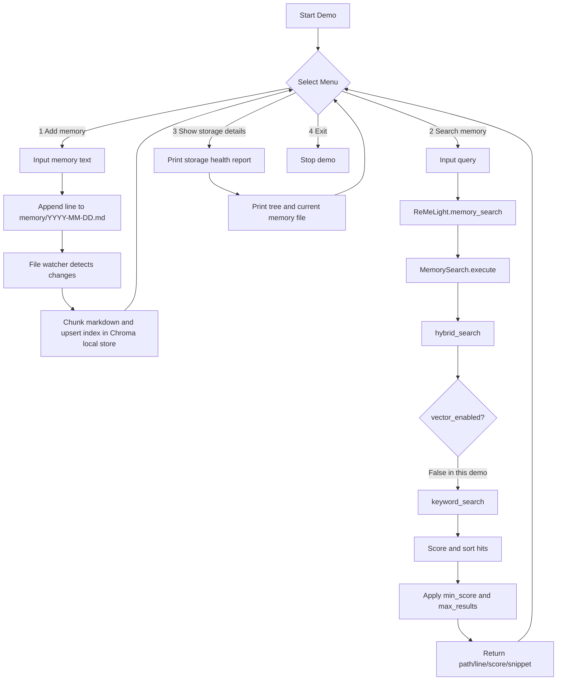

## Overview

This demo provides an **interactive local-file memory workflow** based on `ReMeLight`.
It includes:

- Interactive memory input (CLI menu).
- Local retrieval with `ReMeLight.memory_search`.
- Clear visibility into file persistence and storage structure.

## Prerequisites

- Python 3.10+
- `pip`
- Internet access for installing dependencies

Run setup:

```bash
bash setup.sh
```

## Files in This Demo Directory

- `setup.sh`: creates `.venv` and installs required packages.
- `demo_local_file_memory.py`: interactive local file memory and retrieval demo.

## How to Run

FTS mode (default, no embedding service required):

```bash
source .venv/bin/activate
python demo_local_file_memory.py
```

Semantic mode (embedding + FTS hybrid):

```bash
source .venv/bin/activate
# Set your OpenAI-compatible embedding endpoint and key (if required)
export EMBEDDING_BASE_URL=http://localhost:8000/v1
export EMBEDDING_API_KEY=local
python demo_local_file_memory.py --mode semantic --embedding-model text-embedding-3-small
```

Semantic local mode (in-process open-source model, no embedding API):

```bash
source .venv/bin/activate
python demo_local_file_memory.py --mode semantic-local --embedding-model sentence-transformers/all-MiniLM-L6-v2
```

If semantic-local fails with `name 'nn' is not defined` or `PyTorch was not found`, rebuild the env:

```bash
rm -rf .venv
bash setup.sh
source .venv/bin/activate
python demo_local_file_memory.py --mode semantic-local --embedding-model sentence-transformers/all-MiniLM-L6-v2
```

Platform note:

- Some Python/CPU platform combinations do not have a compatible local `torch` wheel for latest `sentence-transformers`.
- If `semantic-local` fails to start, use:
  - `--mode fts` (no embedding), or
  - `--mode semantic` with an OpenAI-compatible embedding service.

Custom working directory:

```bash
python demo_local_file_memory.py --mode fts --working-dir /absolute/path/to/demo_store
```

Default mode-specific working directories:

- FTS mode: `demos/.reme_local_demo_fts`
- Semantic mode: `demos/.reme_local_demo_semantic`
- Semantic local mode: `demos/.reme_local_demo_semantic_local`

## Interactive Commands

- `1. Add memory`: append one memory line into `memory/YYYY-MM-DD.md`.
- `2. Search memory`: query local memory via `ReMeLight.memory_search`, then display hit count, path, score, snippet, and nearby lines.
- `3. Show storage details`: print storage health report (file counts, index status, latest files) plus file tree and current memory content.
- `4. Exit`: stop the demo.

## Local Storage Flow (ReMeLight)

1. User inputs memory text in CLI.
2. Demo appends this text to `.reme_local_demo/memory/YYYY-MM-DD.md`.
3. ReMe file watcher observes the `memory/` directory and updates local retrieval index.
4. Retrieval request calls `memory_search` and returns file path, line range, score, and snippet.
5. Session messages are persisted into `.reme_local_demo/dialog/YYYY-MM-DD.jsonl`.



## Keyword Search Core Logic (Current Demo Path)

In this demo, search runs with `vector_enabled=False` and `fts_enabled=True`, so retrieval uses the keyword branch.

1. Validate input:
   - Empty query returns empty result.
   - `max_results` and `min_score` are normalized in `memory_search`.
2. Tokenize query:
   - Split query by whitespace into words.
   - Build case variants for each word (`original/lower/capitalized/upper`) because Chroma `$contains` is case-sensitive.
3. Build filters:
   - Source filter defaults to memory source (`memory/*.md`).
   - Document filter uses `$contains` / `$or` against query word variants.
4. Retrieve candidates:
   - Query Chroma collection with `documents` and `metadatas`.
5. Score each chunk:
   - `base_score = matched_words / total_query_words`
   - Add phrase bonus (`+0.2`) when multi-word full phrase appears.
   - Cap score to `1.0`.
6. Sort and post-filter:
   - Sort by score descending.
   - Apply `min_score` threshold and keep top `max_results`.
7. Return structured records:
   - `path`, `start_line`, `end_line`, `score`, `snippet`, `source`.

## Semantic Mode Notes

- Semantic mode in this demo enables `vector_enabled=True` and keeps `fts_enabled=True`.
- The current ReMe package in this environment uses an OpenAI-style embedding backend.
- You can still use open-source small embedding models if you expose them through an OpenAI-compatible API service.
- Typical setup is a local embedding service endpoint + model name + optional API key.

## Semantic Local Mode Notes

- `semantic-local` registers a custom embedding backend key: `local_st`.
- Embedding generation runs in-process via `sentence-transformers`, no HTTP API required.
- Suggested starter model: `sentence-transformers/all-MiniLM-L6-v2` (lightweight).

## File Watcher Rules (ReMeLight)

1. Default watch targets:
   - `WORKING_DIR/MEMORY.md`
   - `WORKING_DIR/memory.md`
   - `WORKING_DIR/memory/`
2. File filter:
   - Default suffix filter is `.md`.
   - Default non-recursive directory watch (`recursive=false`).
3. Startup behavior:
   - Rebuild index on start (clear old index, then rescan existing watched files).
4. Change handling:
   - Added/modified markdown files are chunked and upserted to local file store.
   - Deleted files are removed from index.

## Key Local Files and Their Roles

- `.reme_local_demo/memory/YYYY-MM-DD.md`: human-readable long-term memory entries.
- `.reme_local_demo/dialog/YYYY-MM-DD.jsonl`: persisted conversation/session records.
- `.reme_local_demo/file_store/chroma.sqlite3`: local retrieval index storage used by ReMe.
- `.reme_local_demo/tool_result/`: cache directory for large tool outputs (when enabled in flow).
- `.reme_local_demo/embedding_cache/`: local embedding cache data directory.

## Functional Scope in This Demo

- Covered:
  - Local memory input.
  - Local indexed retrieval.
  - Local persistence inspection.
- Not covered:
  - LLM-based `summary_memory` generation.
  - Remote embedding/vector backends.

## Notes

- This demo is designed for **local file memory flow** and avoids mandatory remote summarization calls.
- Current config uses `vector_enabled=False`, focusing on local FTS-style retrieval.
- If you later want semantic retrieval, enable vector-related config and embedding settings.
- Avoid installing `reme` directly from PyPI for this demo. It is a different package with the same name; use `bash setup.sh` to install AgentScope ReMe from GitHub.
