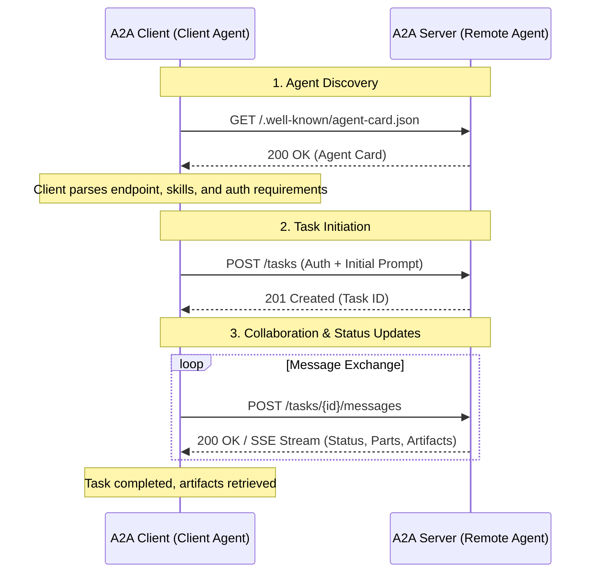

# A2A Protocol (Agent2Agent Protocol)

## Overview
The Agent2Agent (A2A) Protocol is an open standard designed to facilitate seamless communication and interoperability between AI agents. Originally developed by Google and now donated to the Linux Foundation, A2A provides a common language for agent collaboration in an ecosystem where agents are built using diverse frameworks (such as LangGraph, CrewAI, and Semantic Kernel) by different vendors.

A2A acts as a universal communication layer, allowing agents to interoperate, delegate tasks, and share findings regardless of their underlying architecture.

## Why it Matters
The A2A Protocol addresses several critical challenges in the evolving agentic landscape:
- **Interoperability**: Connects agents built on different platforms to create powerful, composite AI systems.
- **Complex Workflows**: Enables agents to coordinate and delegate sub-tasks, solving complex problems that exceed the capabilities of a single agent.
- **Security & Privacy**: Agents can interact without exposing internal memory, proprietary logic, or tool definitions, maintaining a "black-box" interaction model.
- **Decentralization**: Provides a public internet-like standard for the "Internet of Agents," allowing both local and remote agents to collaborate securely.

## Key Principles
The A2A Protocol is built on several fundamental concepts that define how agents interact:

### Core Actors
- **User**: The end user (human or automated service) who initiates a goal or request.
- **A2A Client (Client Agent)**: An application or agent that acts on behalf of the user and initiates communication using the A2A protocol.
- **A2A Server (Remote Agent)**: An agentic system that exposes an HTTP endpoint implementing the A2A protocol, receiving and processing tasks.

### Fundamental Communication Elements
- **Agent Card**: A JSON metadata document describing an agent's identity, capabilities, skills, and authentication requirements. It is the core of agent discovery.
- **Task**: A stateful unit of work with a unique ID and defined lifecycle, allowing for long-running operations and multi-turn collaboration.
- **Message**: A single turn of communication containing content and a role ("user" or "agent").
- **Part**: The fundamental content container (text, raw bytes, URL, or structured data), supporting multi-modal exchange.
- **Artifact**: A tangible output generated during a task (e.g., documents, images, or structured data).

## Agent Card & Discovery

### Agent Card Definition
The **Agent Card** is a JSON "business card" for an A2A Server. It defines what an agent can do and how to interact with it securely. Key components include:
- **Identity**: Name, description, and provider information.
- **Service Endpoint**: The base URL for the A2A service.
- **A2A Capabilities**: Features supported, such as `streaming` or `pushNotifications`.
- **Authentication**: Required auth schemes (e.g., `Bearer`, `OAuth2`).
- **Skills**: A list of `AgentSkill` objects describing specific tasks, including `id`, `name`, `description`, `inputModes`, and `outputModes`.

### Discovery Mechanisms
AI agents need to find each other before they can collaborate. A2A standardizes this through several discovery strategies:

1. **Well-Known URI (Recommended)**:
   The client performs an HTTP GET request to a standardized path: `https://{domain}/.well-known/agent-card.json`. This is ideal for public or domain-controlled agents.
2. **Curated Registries (Catalog-Based)**:
   A central repository where agents publish their Agent Cards. Clients can query the registry based on skills, tags, or provider names.
3. **Direct Configuration**:
   Hardcoded configuration or environment variables, common in tightly coupled or private systems.

## Interaction Flow
The following diagram illustrates the typical A2A interaction, from discovery to task completion:

## AI Context
In the broader AI ecosystem, A2A is a complementary standard to the **Model Context Protocol (MCP)**:
- **MCP (Agent-to-Tool)**: Standardizes how an agent connects to its tools, APIs, and resources.
- **A2A (Agent-to-Agent)**: Standardizes how an agent connects to other agents.

Together, these protocols form a complete stack for building robust agentic applications: MCP enables an agent to "do" things with tools, while A2A enables an agent to "collaborate" with other agents. This synergy is central to frameworks like Cisco's `agntcy`, which leverages both for agent discovery and tool calling.

## References 
- [Official A2A Protocol Documentation](https://a2a-protocol.org/latest/)
- [Core Concepts - A2A Protocol](https://a2a-protocol.org/latest/topics/key-concepts/)
- [Agent Discovery - A2A Protocol](https://a2a-protocol.org/latest/topics/agent-discovery/)
- [A new era of Agent Interoperability](https://developers.googleblog.com/en/a2a-a-new-era-of-agent-interoperability/)
- [Agents are not tools](https://discuss.google.dev/t/agents-are-not-tools/192812)
