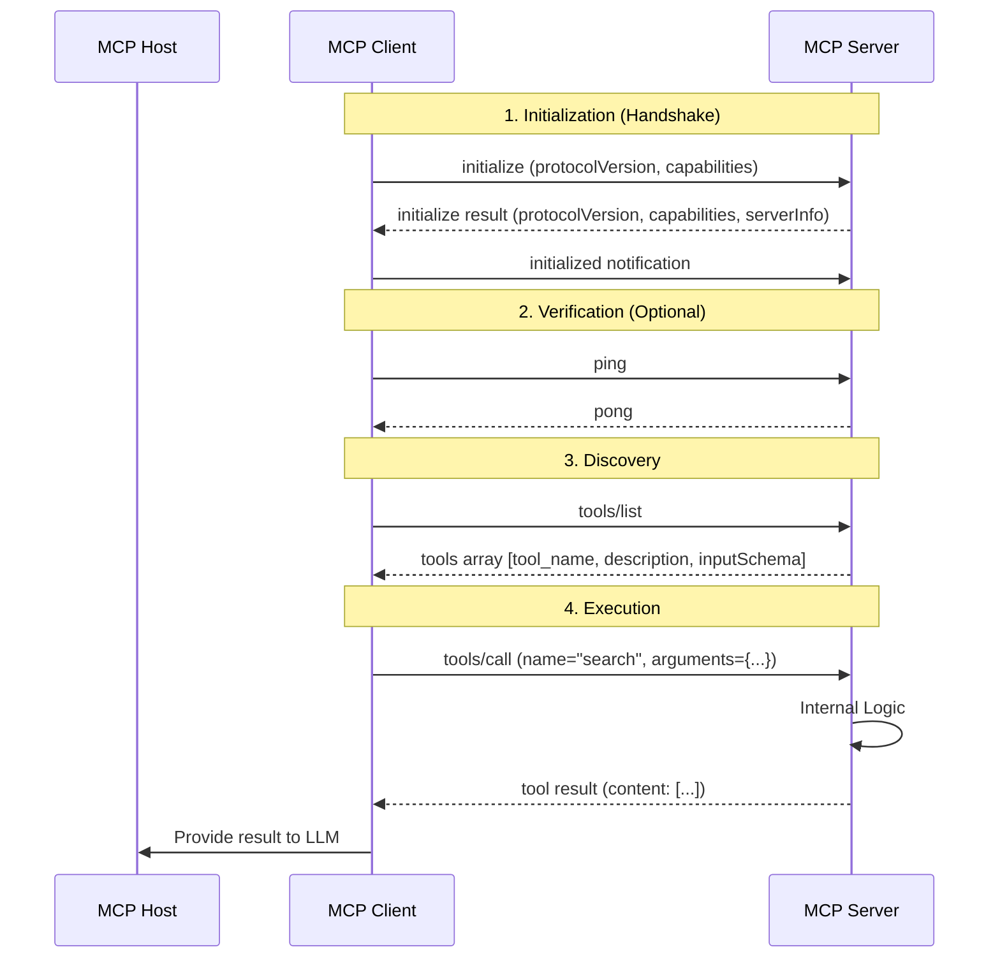

# Model Context Protocol (MCP)

## Overview
The **Model Context Protocol (MCP)** is an open standard introduced by Anthropic to solve the "context problem" for AI agents. It acts as a universal connector (the "USB-C for AI") that allows LLM applications (like Claude Desktop or IDEs) to seamlessly integrate with local and remote tools, data sources, and prompts without writing custom, brittle connectors for each service.

Official Documentation: [Anthropic MCP Docs](https://docs.anthropic.com/en/docs/agents-and-tools/mcp) | [MCP Official Website](https://modelcontextprotocol.io/)

## Why it Matters
Before MCP, every integration between an LLM and a tool (like GitHub, Google Drive, or a local database) required manual, non-standardized implementation. This led to:
- **Fragmentation:** Each tool had its own API and schema.
- **Maintenance Burden:** Developers had to update multiple custom connectors.
- **Limited Portability:** A tool built for one LLM host wouldn't easily work with another.

MCP standardizes this, enabling a **modular AI ecosystem** where tools can be built once and used across any MCP-compliant host (e.g., Cursor, Claude Desktop, Windsurf).

## Key Principles: The Three Primitives
An MCP server exposes three main types of capabilities to a client:

1.  **Tools (Model-Controlled):** Executable functions that the LLM can call to perform actions (e.g., "query the database," "create a Git branch").
2.  **Resources (App-Controlled):** Data that the LLM can read but not execute (e.g., "read this local file," "fetch these logs").
3.  **Prompts (User-Controlled):** Predefined templates or instructions that help the user interact with the model for specific workflows (e.g., "analyze this code for bugs").

## Protocol Architecture & Interaction
MCP follows a **Client-Server Architecture**, where:
-   **MCP Host**: An AI application (e.g., Claude Code or Claude Desktop) that coordinates and manages one or more MCP clients.
-   **MCP Client**: A component that maintains a connection to an MCP server and obtains context from an MCP server for the MCP host to use. Each MCP Host creates one MCP Client for each MCP Server.
-   **MCP Server**: A program that provides context to MCP clients. MCP Servers can run locally or remotely.

For example: Visual Studio Code acts as an MCP Host. When Visual Studio Code establishes a connection to a Sentry MCP Server, it instantiates an MCP Client object that maintains the connection to the Sentry MCP Server. When it subsequently connects to another MCP Server (e.g., the local filesystem server), it instantiates an additional MCP Client object to maintain this connection.

### Detailed Interaction Lifecycle
Based on the [MCP JSON-RPC Schema](https://github.com/modelcontextprotocol/modelcontextprotocol/blob/main/schema/2025-11-25/schema.ts), the interaction between a Client and Server follows a strict lifecycle:

#### 1. Connection Establishment & Initialization
Before any capabilities are used, the client and server must perform a handshake to negotiate protocol versions and capabilities.
-   **`initialize` Request**: The client sends its supported protocol version and capabilities (e.g., `sampling`, `roots`).
    ```json
    {
      "jsonrpc": "2.0",
      "id": 1,
      "method": "initialize",
      "params": {
        "protocolVersion": "2025-11-25",
        "capabilities": {
          "sampling": {},
          "roots": {}
        }
      }
    }
    ```
-   **`initialize` Response**: The server responds with its own version, capabilities (e.g., `tools`, `resources`, `prompts`), and server metadata.
    ```json
    {
      "jsonrpc": "2.0",
      "id": 1,
      "result": {
        "protocolVersion": "2025-11-25",
        "capabilities": {
          "tools": {},
          "resources": {},
          "prompts": {}
        },
        "serverInfo": {
          "name": "Example MCP Server",
          "version": "1.0.0"
        }
      }
    }
    ```
-   **`initialized` Notification**: The client sends this notification to confirm the handshake is complete. No requests should be sent before this.
    ```json
    {
      "jsonrpc": "2.0",
      "method": "initialized",
      "params": {}
    }
    ```

#### 2. Connection Verification (Optional/Transport Level)
While the Data Layer relies on the handshake, the Transport Layer ensures the connection remains alive:
-   **`ping`**: Either participant can send a ping request to verify the other party is still responsive.
    ```json
    {
      "jsonrpc": "2.0",
      "id": 2,
      "method": "ping",
      "params": {}
    }
    ```
    ```json
    {
      "jsonrpc": "2.0",
      "id": 2,
      "result": "pong"
    }
    ```
-   **Transport Health**: For SSE or STDIO, the underlying process or stream status serves as the primary verification of connectivity.

#### 3. Discovery (Capability Querying)
Once initialized, the client can query the server's specific offerings:
-   **`tools/list`**: Queries all available executable tools.
    ```json
    {
      "jsonrpc": "2.0",
      "id": 3,
      "method": "tools/list",
      "params": {}
    }
    ```
    ```json
    {
      "jsonrpc": "2.0",
      "id": 3,
      "result": [
        {
          "name": "get_weather",
          "description": "Get the current weather for a given city.",
          "inputSchema": {
            "type": "object",
            "properties": {
              "city": {
                "type": "string"
              }
            },
            "required": ["city"]
          }
        }
      ]
    }
    ```
-   **`resources/list`**: Queries available data sources.
    ```json
    {
      "jsonrpc": "2.0",
      "id": 4,
      "method": "resources/list",
      "params": {}
    }
    ```
    ```json
    {
      "jsonrpc": "2.0",
      "id": 4,
      "result": [
        {
          "uri": "mcp://demo/hello",
          "description": "A sample resource that returns a greeting."
        }
      ]
    }
    ```
-   **`prompts/list`**: Queries available interaction templates.
-   **Pagination**: For large sets, these requests support `cursor`-based pagination.

#### 4. Execution (Tool/Resource Interaction)
This is where the core work happens:
-   **`tools/call`**: The client requests the server to execute a specific tool with arguments. The server returns a `CallToolResult` containing text, images, or other content types.
    ```json
    {
      "jsonrpc": "2.0",
      "id": 5,
      "method": "tools/call",
      "params": {
        "name": "get_weather",
        "arguments": {
          "city": "London"
        }
      }
    }
    ```
    ```json
    {
      "jsonrpc": "2.0",
      "id": 5,
      "result": {
        "content": [
          {
            "type": "text",
            "text": "The weather in London is sunny and 25°C."
          }
        ]
      }
    }
    ```
-   **`resources/read`**: The client requests the content of a specific resource URI.
    ```json
    {
      "jsonrpc": "2.0",
      "id": 6,
      "method": "resources/read",
      "params": {
        "uri": "mcp://demo/hello"
      }
    }
    ```
    ```json
    {
      "jsonrpc": "2.0",
      "id": 6,
      "result": {
        "content": [
          {
            "type": "text",
            "text": "Hello from the FastAPI MCP Server!"
          }
        ]
      }
    }
    ```
-   **`prompts/get`**: The client fetches a specific prompt template, often used to set up the initial context for the LLM.
    ```json
    {
      "jsonrpc": "2.0",
      "id": 7,
      "method": "prompts/get",
      "params": {
        "uri": "mcp://example/prompt/code_review"
      }
    }
    ```
    ```json
    {
      "jsonrpc": "2.0",
      "id": 7,
      "result": {
        "content": [
          {
            "type": "text",
            "text": "Please review the following code for bugs and suggest improvements:\n\n```python\n{{code}}\n```"
          }
        ],
        "inputSchema": {
          "type": "object",
          "properties": {
            "code": {
              "type": "string",
              "description": "The code to be reviewed."
            }
          },
          "required": ["code"]
        }
      }
    }
    ```

#### 5. Termination
-   **Standard Exit**: For STDIO, closing the input stream triggers a clean exit. For HTTP, the connection is stateless, but the SSE stream is closed.

### Communication Flow


### Protocol Layers
MCP consists of two main layers:

1.  **Data Layer**: Defines the JSON-RPC based client-server communication protocol, including lifecycle management and core primitives (such as tools, resources, prompts, and notifications).
    *   **Lifecycle Management**: Handles connection initialization, capability negotiation, and connection termination between clients and servers.
    *   **Server Capabilities**: Enables servers to provide core functionality including **Tools** for AI actions, **Resources** for context data, and **Prompts** for interaction templates from and to the client.
    *   **Client Capabilities**: Enables servers to ask the client to sample from the Host LLM, elicit input from the user, and log messages to the client.
    *   **Utility Capabilities**: Supports additional features like notifications for real-time updates and progress tracking for long-running operations.

2.  **Transport Layer**: Defines the communication mechanisms and channels that enable data exchange between clients and servers, including transport-specific connection establishment, message framing, and authorization.
    MCP supports multiple transport mechanisms:

    Historically, MCP utilized HTTP+SSE for remote communication, but has since transitioned to Streamable HTTP starting from protocol version 2026-03-26 due to limitations of SSE for MCP's specific needs.

    -   **STDIO Transport**: Uses standard input/output streams for direct process communication between local processes on the same machine, providing optimal performance with no network overhead.
    -   **Streamable HTTP Transport**: Uses HTTP POST for client-to-server messages. This transport enables remote server communication and supports standard HTTP authentication methods, including bearer tokens, API keys, and custom headers. MCP recommends using OAuth to obtain authentication tokens. Streamable HTTP addresses limitations of SSE by enabling stateless communication and supporting on-demand upgrades to SSE, improving compatibility with modern infrastructure and guaranteeing more stable and efficient communication.
    -   **Server-Sent Events (SSE)**: While SSE allows web clients to receive automatic, unidirectional updates from a server over a single, long-lived HTTP connection, it has limitations for MCP's primary use cases. These include no inherent support for resumable streams, requiring the server to maintain a long-lived connection, and only allowing server messages to be delivered via SSE (clients must use separate HTTP POST requests for sending messages). Therefore, for bidirectional communication in MCP, it's generally not the recommended primary method.

The transport layer abstracts communication details from the protocol layer, allowing the same JSON-RPC 2.0 message format across all transport mechanisms.

## Verification and Testing

The **MCP Inspector** is the primary interactive developer tool for testing and debugging MCP servers. It allows developers to verify server implementation without needing a full MCP host like Claude Desktop.

### Getting Started with Inspector
The **MCP Inspector** is an interactive web-based tool. It functions as both an MCP client (connecting to your server) and an HTTP server (serving the web UI at `http://localhost:6274`).

#### **1. For Local Servers (STDIO Transport)**
If you are developing a local server or using a published package, you can launch the Inspector and connect to it in one command by passing the server's startup command as arguments:

**General Syntax:**
```bash
npx @modelcontextprotocol/inspector <server-command> <args>
```
**Common Examples:**
```bash
# Inspect a local Node.js server
npx @modelcontextprotocol/inspector node path/to/server/index.js

# Inspect a local Python server (using uv)
npx @modelcontextprotocol/inspector uv run path/to/server/main.py

# Inspect a published npm package
npx -y @modelcontextprotocol/inspector npx @modelcontextprotocol/server-filesystem /Users/username/Desktop

# Inspect a published PyPI package (using uvx)
npx @modelcontextprotocol/inspector uvx mcp-server-git --repository ~/code/repo.git
```
*The Inspector will automatically launch the server process and establish an STDIO connection.*

#### **2. For Remote Servers (Streamable HTTP / SSE Transport)**
1.  Run the Inspector without arguments (or with any local command):
    ```bash
    npx @modelcontextprotocol/inspector
    ```
2.  Open the Inspector UI in your browser (default: `http://localhost:6274`).
3.  In the **"Server Connection"** pane:
    -   Select the **"SSE"** or **"Streamable HTTP"** transport from the dropdown.
    -   Enter your server's endpoint URL (e.g., `http://localhost:8000/sse`).
    -   (Optional) Add any required authentication headers (e.g., `Authorization: Bearer <token>`).
4.  Click **"Connect"** to initiate the handshake.

### Recommended Workflow
1.  **Initial Connectivity**: Launch the Inspector to verify the `initialize` handshake and capability negotiation.
2.  **Feature Validation**: Use the specific tabs to test each tool, resource, and prompt against their expected behavior.
3.  **Edge Case Testing**: Proactively test invalid inputs, missing arguments, and concurrent operations to ensure robust error responses.

## AI Context: The "Operating System" for Agents
In the AI Era, MCP is evolving into a foundational layer similar to how an Operating System manages device drivers. Just as a mouse works on any PC via USB, an MCP-compliant tool works on any AI assistant. This decoupling of "Intelligence" from "Context" is the key to building truly scalable and interoperable Multi-Agent Systems (MAS).
