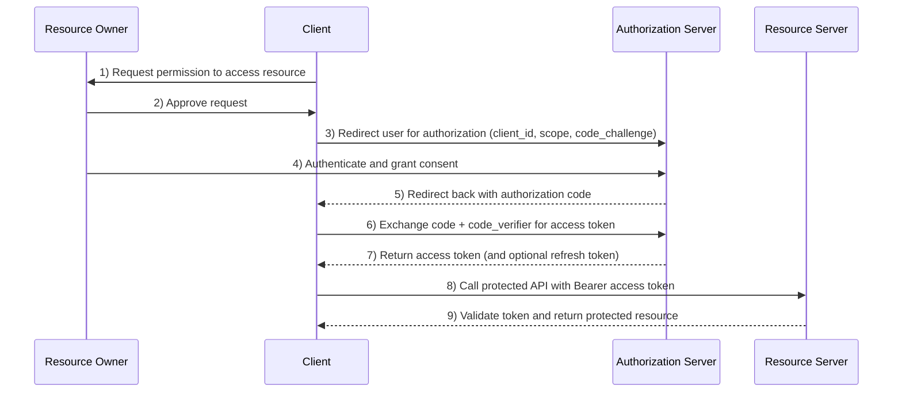
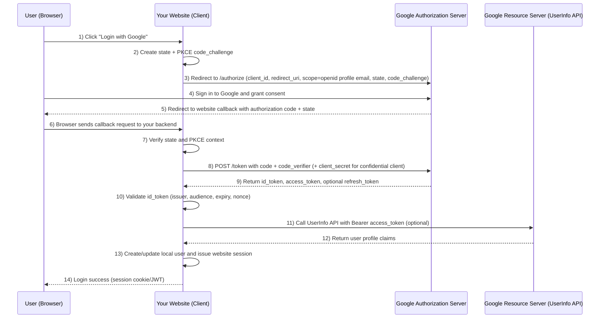

# OAuth 2.0

## Overview
OAuth 2.0 is the industry-standard protocol for **authorization** (not authentication). It enables an application to access protected resources on behalf of a user without handling the user's password directly.

Instead of sharing credentials, OAuth uses access tokens with constrained permissions and lifetime. This delegation model is now the default way to secure API access across web apps, mobile apps, SPAs, backend services, and device-based clients.

## Why it Matters
- **Credential Isolation**: Client applications do not need to store end-user passwords for upstream systems.
- **Least Privilege**: Access is limited by scopes and token lifetime, reducing blast radius.
- **Revocability**: Tokens can be revoked or rotated without changing user credentials.
- **Interoperability**: A common standard with broad ecosystem support and mature tooling.
- **Scalability**: Authorization logic can be centralized at dedicated authorization servers or gateways.

## Key Principles

### Core Roles
OAuth 2.0 defines four fundamental roles:
- **Resource Owner**: User or system that owns the protected data.
- **Client**: App requesting delegated access.
- **Authorization Server**: Issues tokens after authentication and consent.
- **Resource Server**: Hosts protected APIs/resources and validates tokens.

### One-Time Authorization and Resource Access (4 Roles)
The sequence below shows a typical single authorization cycle based on Authorization Code + PKCE: the user grants consent once, the client gets an access token, then calls the protected resource.

### Tokens and Scopes
- **Access Token**: Short-lived credential used to call protected APIs.
- **Refresh Token**: Long-lived credential used to obtain new access tokens.
- **Scope**: Explicit permission boundary (for example, read-only vs write).

OAuth 2.0 does not mandate a single token format, but JWT-based tokens are common in production systems.

### Common Grant Types
- **Authorization Code (+ PKCE)**: Preferred for browser/mobile/public clients.
- **Client Credentials**: Service-to-service access without end-user interaction.
- **Device Authorization**: Input-constrained devices (for example, TVs).
- **Refresh Token Flow**: Session continuity without repeated user sign-in.

Legacy flows such as Implicit and Password Grant are now generally discouraged.

### Security Baseline and Extensions
The OAuth ecosystem includes key standards and best practices:
- **Bearer Token Usage**: RFC 6750
- **OAuth 2.0 Framework**: RFC 6749
- **Security BCP**: RFC 9700
- **Token Revocation**: RFC 7009
- **Token Introspection**: RFC 7662
- **Authorization Server Metadata**: RFC 8414
- **High-Security Profiles/Extensions**: PAR, DPoP, mTLS, private_key_jwt

## Example: Google Third-Party Login for Your Website
When people say "Login with Google", the implementation is typically OAuth 2.0 Authorization Code with PKCE, plus OpenID Connect (OIDC) to obtain user identity claims.

### Role Mapping in This Scenario
- **Resource Owner**: Your end user (the person logging in).
- **Client**: Your website application (usually frontend + backend).
- **Authorization Server (Google)**: Google Accounts endpoints that authenticate users and issue authorization codes/tokens.
- **Resource Server (Google)**: Google APIs (for example, UserInfo endpoint) that return profile data when a valid access token is provided.

### What "My Google App" Represents
Your "Google App" in Google Cloud Console is the OAuth client registration for your website. It provides:
- **Client ID**: Public identifier of your website as an OAuth client.
- **Client Secret**: Confidential credential for backend token exchange (never expose in browser code).
- **Authorized Redirect URIs**: Exact callback URLs Google can redirect to after user consent.
- **Consent Screen Settings**: App name, scopes, branding, and publishing status.

In other words, "my Google app" is not your runtime app server; it is the trust configuration that allows Google to recognize and authorize your website.

### End-to-End Login Interaction Flow

### Practical Notes
- **OAuth vs Login Identity**: OAuth grants API access; OIDC (`id_token`) carries identity for sign-in.
- **Use PKCE**: Recommended even for web apps, and essential for public clients.
- **Protect Secrets**: Keep `client_secret` only on backend servers.
- **Validate Tokens**: Verify `state`, `nonce`, token signature, issuer (`iss`), audience (`aud`), and expiration (`exp`).
- **Minimize Scope**: Request only required scopes, commonly `openid profile email` for login.

## OAuth 2.0 in MCP (Model Context Protocol)
In MCP deployments using HTTP transport, OAuth is a recommended way to authorize MCP clients accessing protected MCP servers.

Typical MCP-oriented flow:
1. Client requests a protected MCP endpoint.
2. MCP server returns `401 Unauthorized` with `WWW-Authenticate`.
3. Client discovers metadata (resource and authorization server metadata endpoints).
4. User authenticates and grants consent at the authorization endpoint.
5. Client exchanges authorization code for tokens (with PKCE).
6. Client retries MCP request with bearer token and receives authorized access.

Implementation notes frequently seen in MCP environments:
- PKCE should be treated as mandatory for public clients.
- HTTPS is required for authorization endpoints and redirect flows.
- Separating resource server and authorization server improves enterprise security posture and maintainability.
- A gateway/proxy can centralize policy, auditing, token handling, and integration with existing IdP infrastructure.

## AI Context
OAuth 2.0 is foundational for safe agentic systems because modern AI applications increasingly operate as delegated actors:
- **Agent-to-Tool Access Control**: Limits what an LLM-powered agent can do against external systems.
- **Bounded Autonomy**: Scopes and expirations constrain unintended or excessive actions.
- **Operational Governance**: Central token policy, revocation, and logs support enterprise oversight.
- **Protocol Composability**: Works alongside MCP (agent-to-tool), A2A (agent-to-agent), and UI protocols to form secure multi-agent stacks.

In practice, robust AI integrations require treating authorization as infrastructure, not a feature.

## References
- [OAuth 2.0 Overview (oauth.net)](https://oauth.net/2/)
- [What is OAuth 2.0? (Auth0)](https://auth0.com/intro-to-iam/what-is-oauth-2)
- [OAuth for MCP Explained (MCP Manager)](https://mcpmanager.ai/blog/oauth-for-mcp/)
